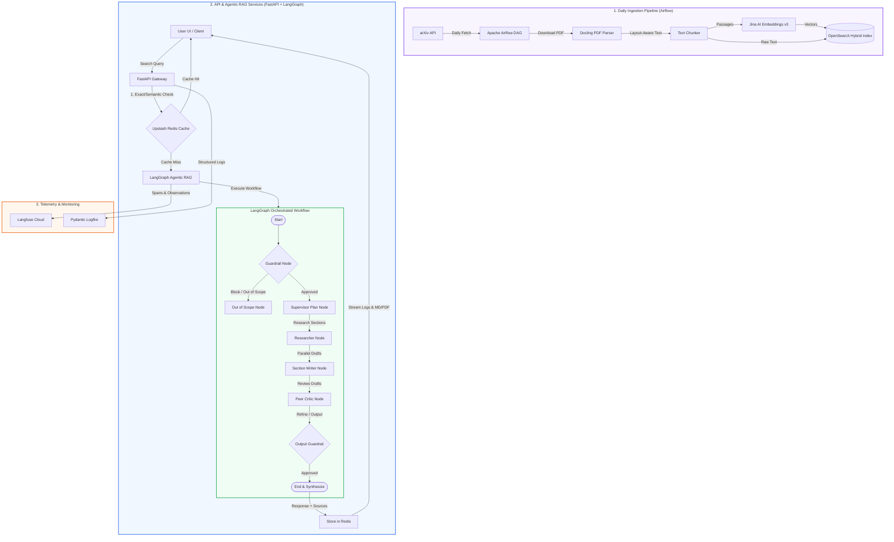
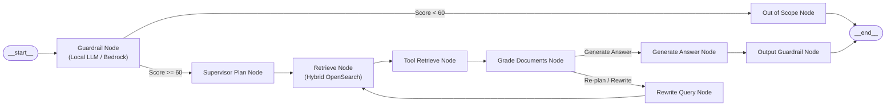

# arXiv Agent: Production-Grade Multi-Agent RAG System

arXiv Agent is a state-of-the-art, production-grade **Multi-Agent Retrieval-Augmented Generation (RAG)** platform. It automates the process of fetching academic research papers from arXiv, performing hybrid indexing (combining semantic vector and lexical BM25 search), and generating high-fidelity literature reviews and answers using a LangGraph-coordinated multi-agent pipeline.

---

## 🏗️ System Architecture

The following diagram illustrates the complete data flow, from daily automated ingestion to real-time agentic query processing and tracing:



### 🧠 LangGraph Workflow Routing
The agent workflow coordinates validation, research planning, parallel section drafting, and validation:



---

## 🌟 Key Features

* **Multi-Agent LangGraph Orchestration**: Implements a complete multi-step RAG state machine with query validation, dynamic search re-planning, grade-based document filtering, and parallel writing agents.
* **Hybrid Search Engine**: Combines lexical (BM25) and semantic (k-NN) search via **OpenSearch** with Jina AI v3 1024-dimensional embeddings, unified using Reciprocal Rank Fusion (RRF).
* **Local & Cloud Guardrails**: Strictly monitors queries against Computer Science / AI / ML / NLP / CV research domains. Uses cloud-based AWS Bedrock Guardrails when available, falling back to a structured local LLM evaluator with strict caching-enabled routing.
* **Robust Ingestion Pipeline**: Powered by **Apache Airflow** DAGs that fetch papers daily, extract high-fidelity text layouts using **Docling**, and index them automatically.
* **Real-time Logging & Dashboard**: Real-time event streaming via EventSource (SSE) logs combined with a dashboard to preview processing states, export summaries, and print formatted PDF reports.
* **Semantic Caching & Telemetry**: Uses **Upstash Redis** for exact and semantic (vector similarity $\ge 0.92$) caching, and **Langfuse** + **Logfire** for request tracing, debugging, and quality monitoring.

---

## 📁 Project Structure

```
├── .github/workflows/      # GitHub Action CI pipelines
├── airflow/                # Apache Airflow DAGs and task setup
├── docker/                 # Service Dockerfiles (OpenSearch, etc.)
├── scripts/                # Utility and ingestion scripts
├── src/                    # Primary application codebase
│   ├── config.py           # Application settings and env validation
│   ├── dependencies.py     # FastAPI dependency injections
│   ├── main.py             # FastAPI entrypoint and routes
│   ├── mcp_server/         # Model Context Protocol (MCP) tool server
│   ├── models/             # Database ORM models (Postgres)
│   ├── repositories/       # DB query layer (Paper repositories)
│   ├── routers/            # FastAPI API endpoints
│   ├── schemas/            # Pydantic data schemas
│   ├── services/           # Business logic layer
│   │   ├── agents/         # LangGraph workflow, nodes, and supervisor
│   │   ├── arxiv/          # arXiv API retrieval client
│   │   ├── cache/          # Redis exact & semantic caching
│   │   ├── embeddings/     # Jina AI embedding service
│   │   ├── indexing/       # Text chunking and hybrid indexing
│   │   ├── pdf_generator/  # Report exporting (Markdown to PDF)
│   │   └── pdf_parser/     # Docling PDF parsing engine
│   └── static/             # Frontend Dashboard interface
├── tests/                  # PyTest suite (Unit, Integration, and Eval)
├── compose.yml             # Docker services orchestration
├── Makefile                # Fast command-line shorthands
└── pyproject.toml          # Project metadata and dependencies
```

---

## ⚡ Quick Start

### 1. Installation
Install the project dependencies using `uv`:
```bash
uv sync
```

### 2. Configure Environment
Copy `.env.example` to `.env` and configure your API credentials:
```bash
cp .env.example .env
```
*Fill in the keys for your LLM Provider, Neon PostgreSQL database, Jina AI, Upstash Redis, and Langfuse Cloud.*

### 3. Start Local Environment
Launch all local services (FastAPI App, Airflow, OpenSearch, and OpenSearch Dashboards) via Docker Compose:
```bash
make start
```

### 4. Application Endpoints
* **Deep Research Dashboard**: [http://localhost:8000](http://localhost:8000)
* **Instant Indexer**: [http://localhost:8000/indexer](http://localhost:8000/indexer)
* **API Documentation (Swagger)**: [http://localhost:8000/docs](http://localhost:8000/docs)
* **Apache Airflow UI**: [http://localhost:8080](http://localhost:8080) *(Credentials: `admin` / `admin`)*
* **OpenSearch Dashboards**: [http://localhost:5601](http://localhost:5601)

---

## 🧪 Testing & Linting

Verify package integrity, types, and lints before shipping:

```bash
make format    # Ruff formatting
make lint      # Ruff lints & MyPy type check
make test      # Pytest execution
```
